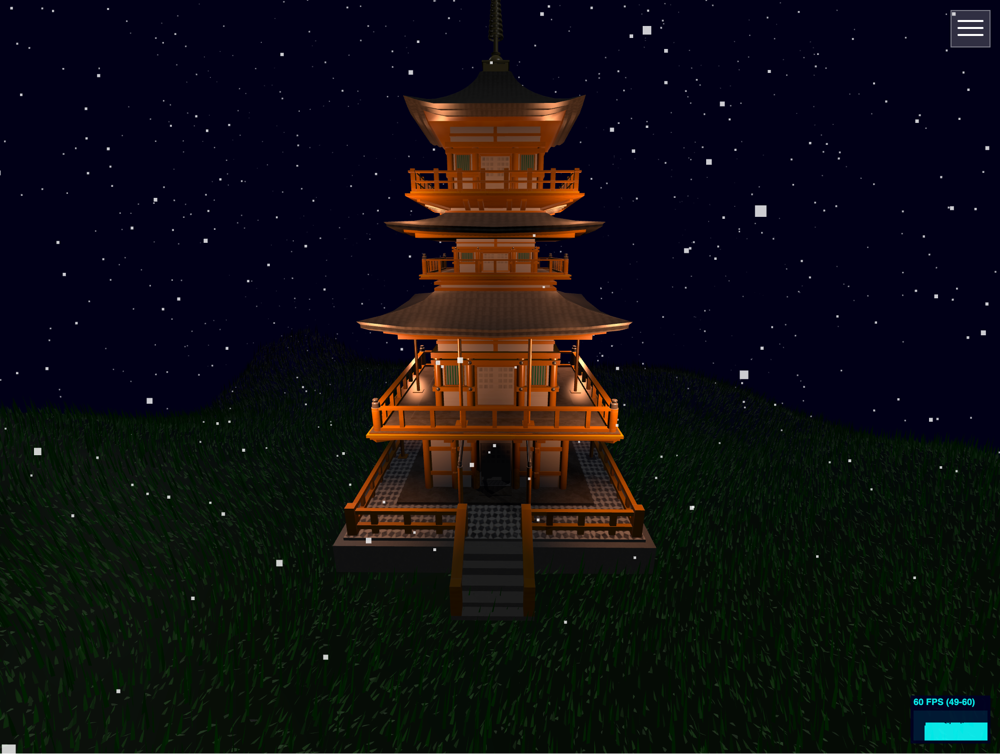

# Three.js japanese temple

A 3D scene built with Three.js featuring a Japanese temple and dynamic environment.



## Features

- Japanese temple & 3D scene
- Procedural grass & shaders
- Snow particles
- Day & night mode
- Dynamic lighting & fog

## Demo

Link: [akht21.github.io/test-threejs](https://akht21.github.io/test-threejs/)

## Running Locally

```bash
npm install
npm run dev
```
